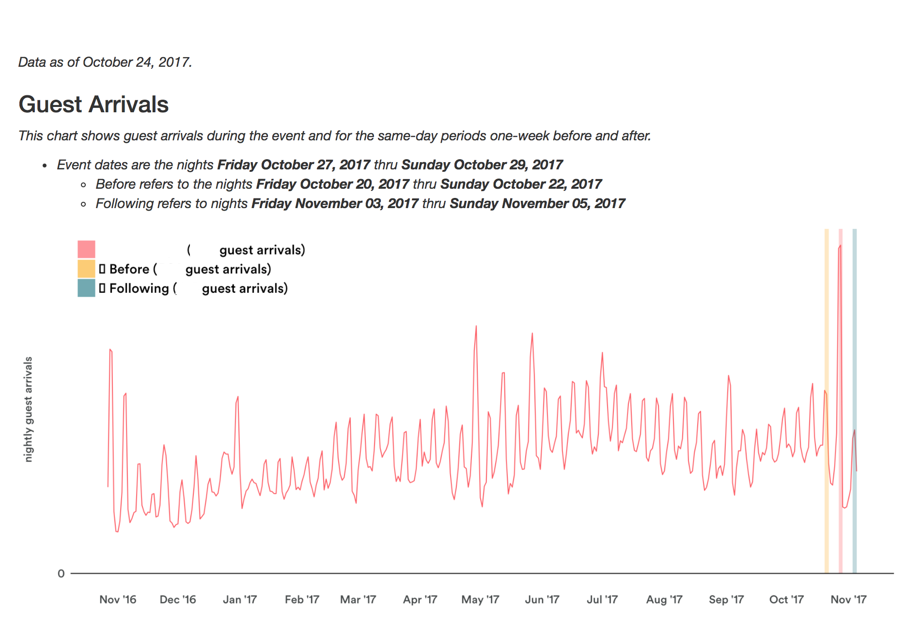
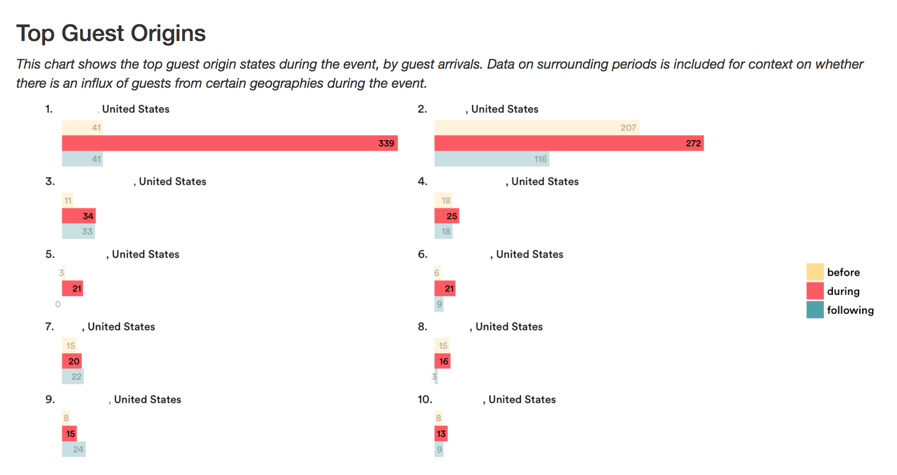
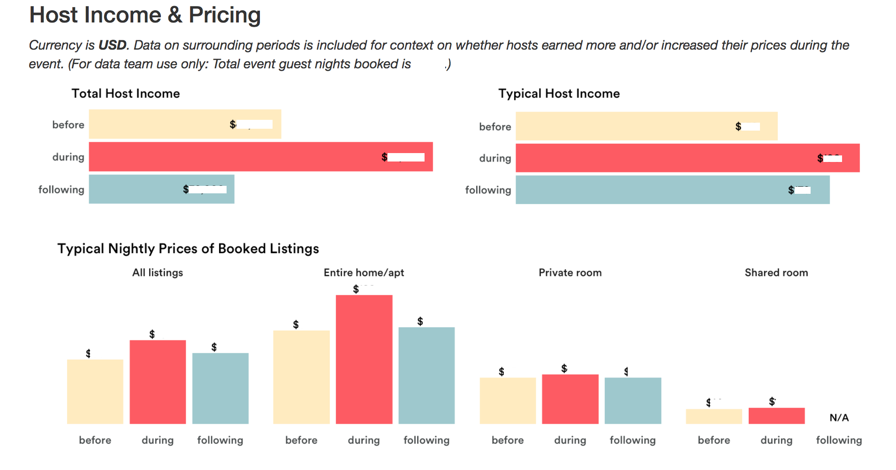

### Overview 

The report collects parameters about the event (name, location and date range). 

Highly optimized SQL code, which requires only three Presto queries to generate all data in the report.
It integrated advanced R and RMarkdown techniques.
Advanced RMarkdown techniques were also applied, to allow multiple events.

Below is an example spike report. For data privacy reasons, the three sections are from three different reports (i.e. events). 

