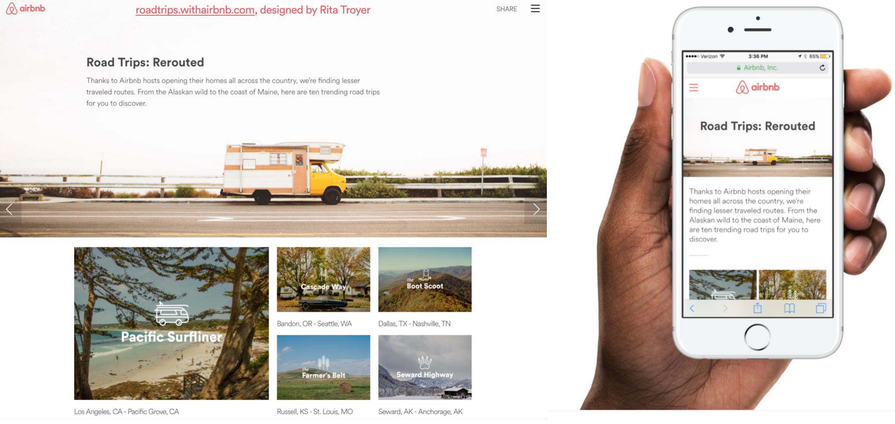
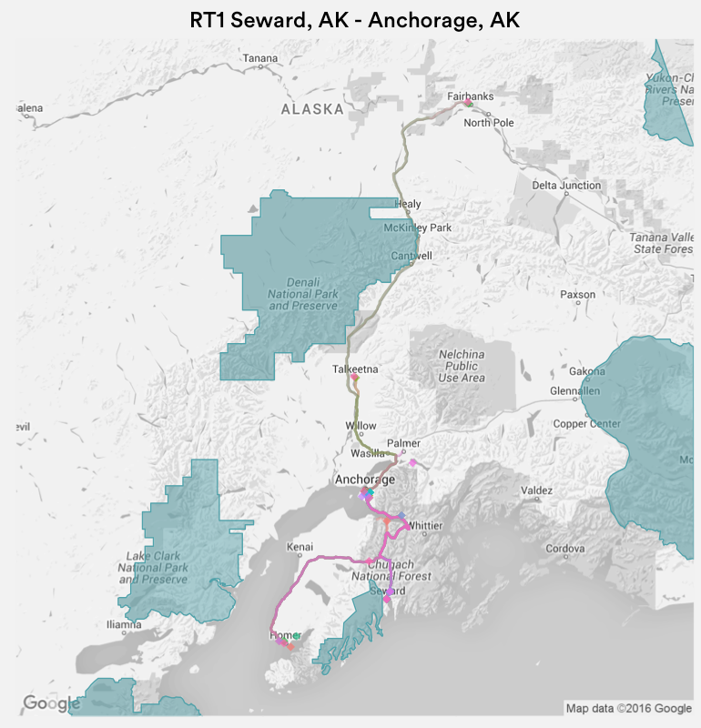
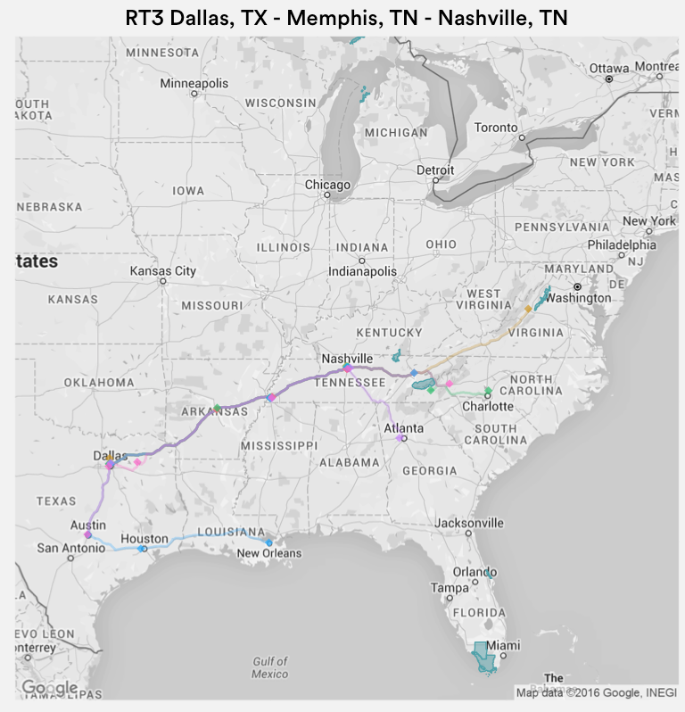
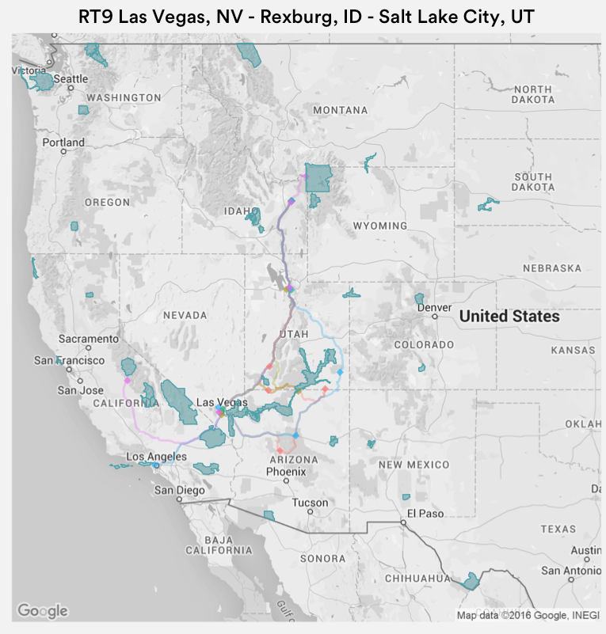
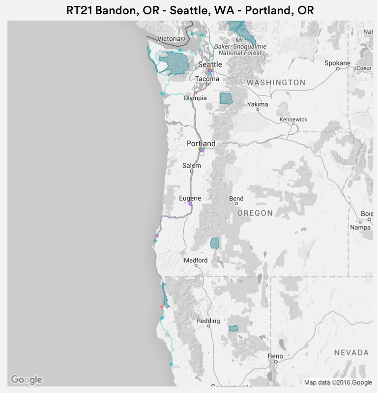

### Overview

Airbnb Roadtrips was the company's first-ever big-data consumer PR story. 



Roadtrips were defined as a chain of bookings at least three-bookings long, with consecutive check-in days. Bookings were restricted to U.S. locations. Thinking of each roadtrip as a transaction of destination cities, the most frequent sets of cities (\"trending roadtrips\") were identified using a market basket analysis. Finally, driving routes of these trending roadtrips were mapped.


### Learning Roadtrips

Internal Airbnb data on roadtrips, as defined above, was queried using HiveQL. The R package __arules__ was used for this market basket analysis. Top item sets were identified by the highest *support*, which is the proportion of all roadtrips that contain a particular item set.

The following code can used to run the market basket analysis. Dummy data and dummy parameters are used for data privacy reasons.

```R
library(arules)
library(ggmap)

library(arules)
library(ggmap)

# Example dataset
RT <- data.frame(
  roadtrip_id = c(1, 1, 1, 
                  2, 2, 2, 2, 
                  3, 3, 3),
  city_state = c("Seward, Alaska", "Homer, Alaska", "Anchorage, Alaska",
                 "Fairbanks, Alaska", "Talkeetna, Alaska", "Cantwell, Alaska", "Seward, Alaska",
                 "Nashville, Tennessee", "Dallas, Texas", "Houston, Texas")
) 

# Prepare dataset for market basket analysis (apriori)
RT <- RT[!duplicated(RT),] # Get rid of duplicated rows
RT <- split(RT$city_state, RT$roadtrip_id) # Spread data so each line is a roadtrip (ie "transaction")
RT <- as(RT, "transactions") # Convert to 'transactions' object

# Run apriori
rules <- apriori(RT, parameter = list(sup = 0.2, conf = .7, target = "rules", minlen = 2))

# Inspect top rules by support
# Support is a measure of how frequently the rule appears in the transactions
inspect(head(sort(rules, by = "support"), 10))

# Create lists of rules so that we can identify roadtrips containing those rules, then map them
# Each list is the merge of a rule's lhs and rhs
rt.toprules <- head(sort(rt.rules, by = "support"), 40)
rt.toprules <- mapply(c, as(rt.toprules@lhs, "list"), as(rt.toprules@rhs, "list"))
```


### Mapping Roadtrips: Method One

Driving routes were mapped using the route() function in __ggmap__. The output (using parameter output = \"all\") of route() contains coordinates of the stops along the legs of the route and encoded polylines. There are many ways to decode the polyline into coordinates that R can understand and connect into a driving route. [This function, _decodeLine_, was used in this analysis]( http://s4rdd.blogspot.com/2012/12/google-maps-api-decoding-polylines-for.html).

```R
library(ggmap)

# This is a dummy dataset of two roadtrips that contain the item set ("rule") of Seward, Alaska, and Homer, Alaska.
stops.rt <- data.frame(
  roadtrip_id = c(1, 1, 1, 
                  2, 2, 2, 2),
  city_state = c("Seward, Alaska", "Homer, Alaska", "Anchorage, Alaska",
                 "Fairbanks, Alaska", "Talkeetna, Alaska", "Cantwell, Alaska", "Seward, Alaska")
) 

ids.rt <- list(1, 1, 1, 2, 2, 2, 2)

# route{ggmap} is not vectorized, nor can it route vectors grouped by IDs, so have to loop 
# Inner for-loop loops thru all stops on a single roadtrip (e.g. Fairbanks to Anchorage to Seward)
# Outer for-loop loops thru all roadtrips in the category (e.g. all Seward hwy road trips)
# All of the route data is recursively rbind-ed in routes.df
# Also, routes that form a roadtrip are labeled with their roadtrip_id 
  routes.df <- data.frame()
  nrow.route.1 <- 1
  nrow.route.total <- 0
  
  for(i in 1:length(ids.rt)) {
    
    for(n in 1:nrow(stops.rt[stops.rt$roadtrip_id == ids.rt[i],])) {
      i <- 1
      n <- 1
      stops.df <- stops.rt[stops.rt$roadtrip_id == ids.rt[i],]
      route <- route(from = as.character(stops.df$city_state[n]), 
                     to = as.character(stops.df$end_city_state[n]), 
                     mode = "driving", structure = "route", output = "all")
      Sys.sleep(1) 
      
      if(route$status == "OK" & !is.null(route$status)) { 
        route <- decodeLine(route$routes[[1]]$overview_polyline$points)
        route$id <- "na"
        nrow.route.total <- nrow.route.total + nrow(route)
        routes.df <- rbind(routes.df, route)
        routes.df$id[nrow.route.1 : nrow.route.total] <- ids.rt[i]
        nrow.route.1 <- 1 + nrow.route.total
      } else {
        break # End route here if you can't drive between the two stops (e.g. Honululu to Hilo)
      }
      
      Sys.sleep(1)
      
    }
    
  }
  
  map <- get_map(location = map_location, maptype = "roadmap", source = "google", 
                 zoom = map_zoom, color = "bw")
  
  ggmap(map) + 
    geom_path(data = routes.df, 
              aes(x = lon, y = lat,group = id, color = id),
              alpha = .3, cex = 1, show.legend = FALSE) +
    geom_point(data = stops.rt2, 
               aes(x = dim_lng, y = dim_lat, color = roadtrip_id),
               alpha = .7, cex = 3, shape = 18, show.legend = FALSE)
  
```









### Mapping Roadtrips: Method One

