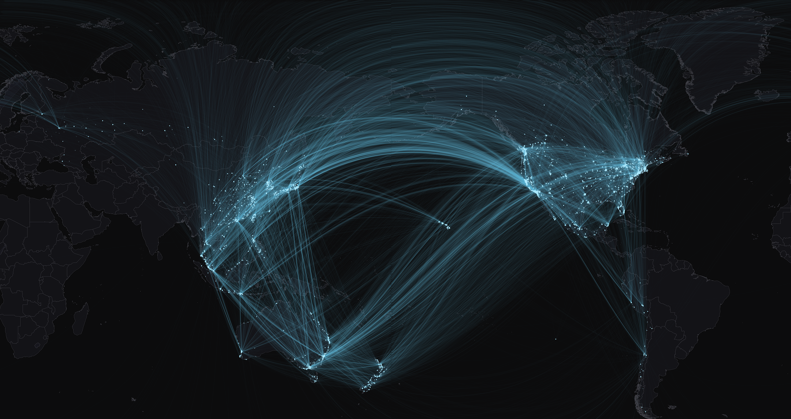
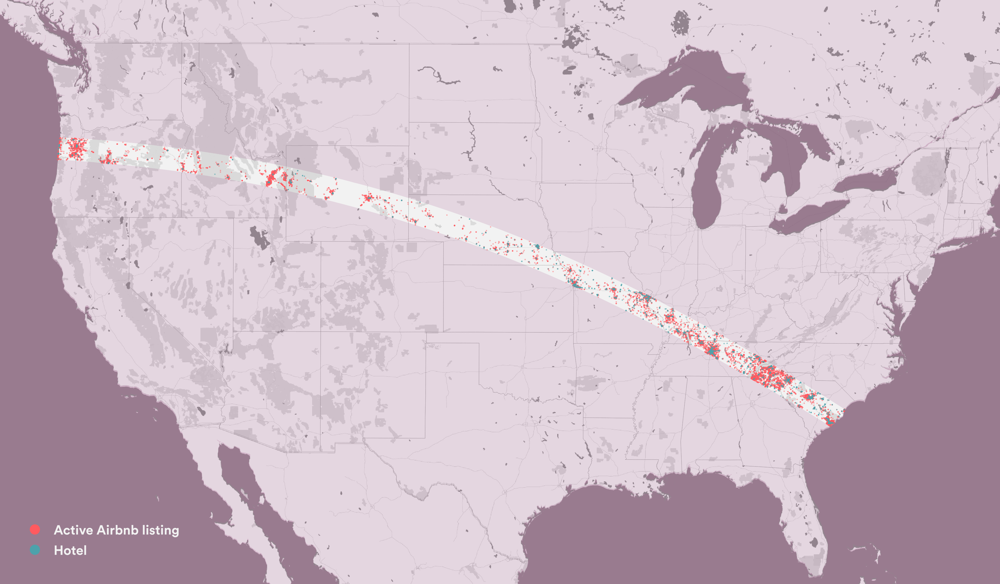
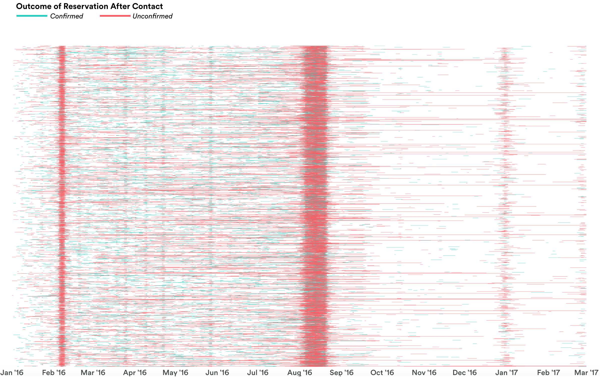
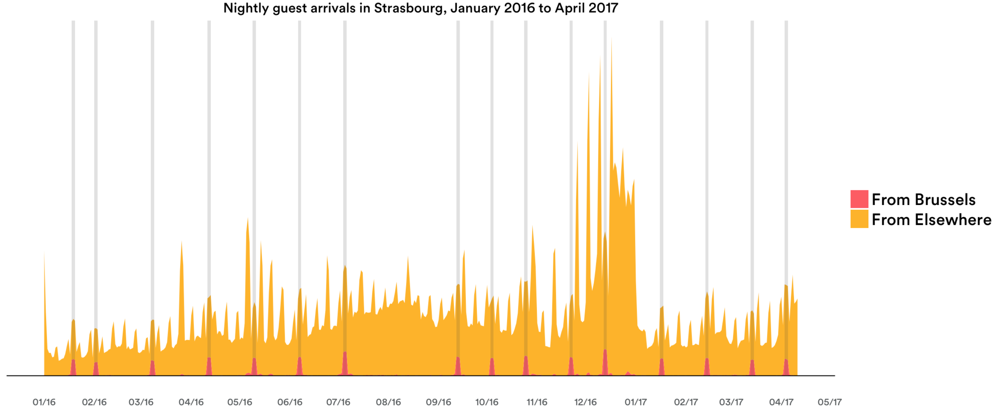
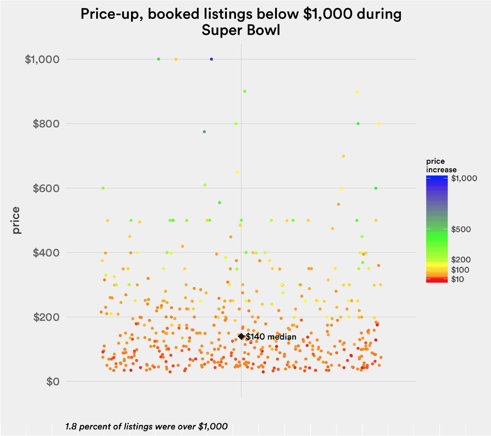

## Travel Corridor Map

This map shows the top international city-to-city travel corridors among [APEC countries](https://www.apec.org/about-us/about-apec/member-economies.aspx), a group of 21 countries along the Pacific Rim. It was created for a November 2017 strategic-partnership [report](https://2sqy5r1jf93u30kwzc1smfqt-wpengine.netdna-ssl.com/wp-content/uploads/2017/11/PC0284-APEC_Report_171107.pdf) about Airbnb's economic impact in the member countries.

Skills engaged:

* Advanced HiveQL to compute top corridors as unordered pairs
* Advanced R/GDAL skills to visualize travel routes onto a minimally-distorted, Pacific-centered map projection

## Total Solar Eclipse Map

This QGIS map shows active Airbnb listings vs. hotels directly on the path of totality, ahead of the August 2017 Great American Solar Eclipse. It has appeared in many public presentations given by top Airbnb executives.

Skill engaged: 

* GIS processing in R, Python and GIS, including geoprocessing pipelines and polygon clipping 

## Timeline Visualization

This ggplot visualization — using artifical Airbnb data for data privacy reasons — shows requested trip nights in guest-to-host contacts. Unlike a simple histogram of requested nights, these jittered lines are able to both maintain visual representation of individual trips, as well as illustrate high-demand nights.

## Product Insight Charts

### European Parliament

This ggplot chart shows a surge in guest arrivals from Brussels, Belgium, during plenary sessions of the European Parliament in Strasbourg, France. The chart was featured publicly in [EUobserver.](https://euobserver.com/business/137889)

### Super Bowl Pricing

This ggplot chart shows price increases of listings booked for Super Bowl 50 in the Bay Area. The chart was part of a project to inform pricing strategy and product messaging, and appeared publicly at the 2017 Hotel Data Conference,

